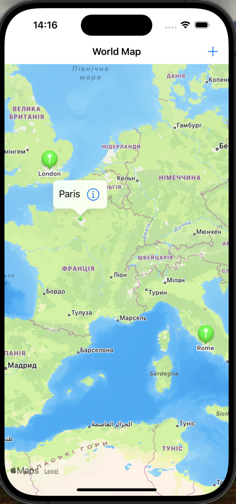
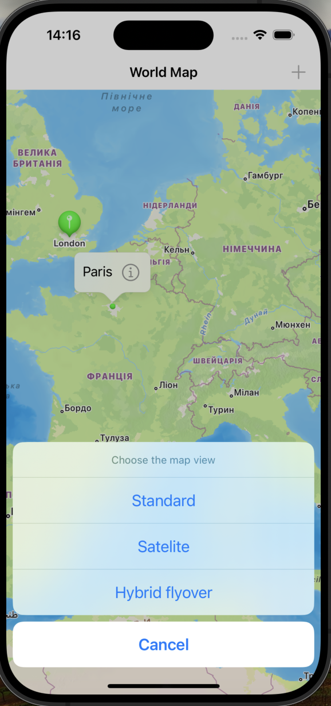
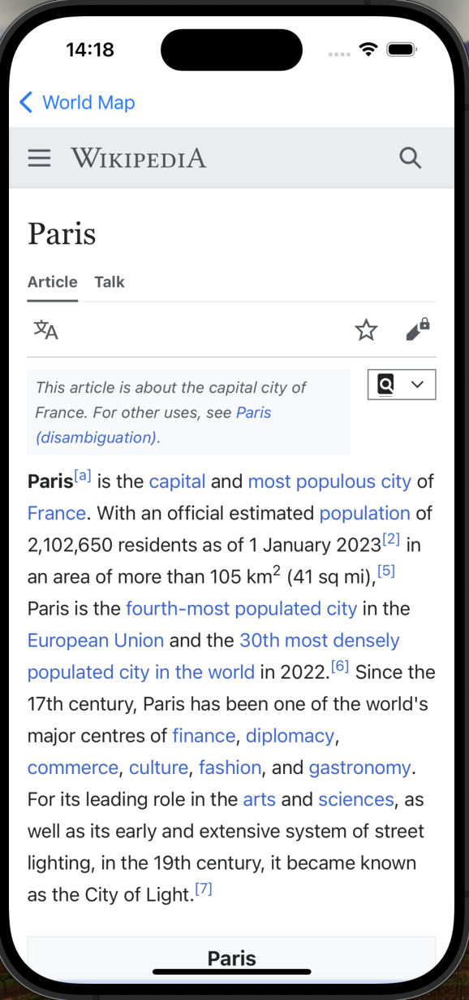

# Project16: Capital Cities

This is an iOS app that displays a map with annotations for various world capitals. The user can tap on the annotations to learn more about each city and switch between different map types.

## Features

* Display a map with annotations for London, Oslo, Paris, Rome, and Washington DC
* Custom annotation views with callout buttons
* Change map types (Standard, Satellite, Hybrid Flyover)
* Detailed information about each city available through Wikipedia

## Screenshots

  
   
  <em>Map Screen</em>

  
   
  <em>Map Options Screen</em>

  
   
  <em>Annotations Screen</em>

## Functionality

* **Annotations:** Custom annotations for the capitals, including callout views with additional info
* **Map Types:** Option to change the map type via an action sheet
* **Detail View:** Pushes a new view controller displaying a Wikipedia page for the selected city

## Controls

* Tap on an annotation to view more information
* Tap the info button in the annotation callout to open the detail view
* Use the navigation bar button to change the map type

## Technical Requirements

* iOS 12.0+
* Xcode 12.0+
* Swift 5.0+

## Possible Development

* Add more cities and annotations
* Implement search functionality to find specific locations
* Enhance detail view with more information and images
* Add user location tracking and directions functionality
